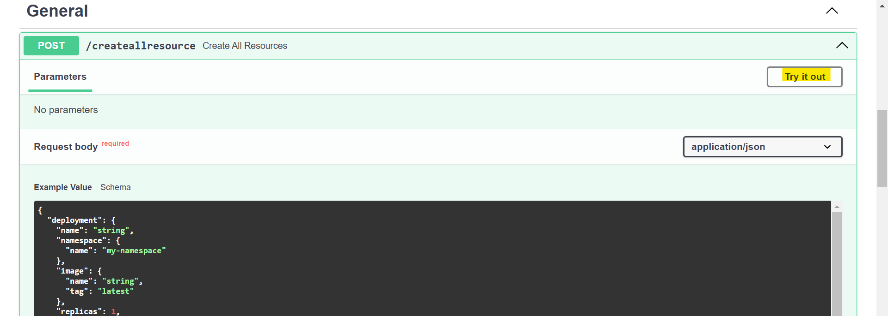

# DevOps Project - Kubernetes API

### Tools and technologies used
- Kubernetes hosted on minikube
- FastAPI a python package used for creating APIs

[Kubernetes] [Minikube] [Python] [FastAPI]

### Guides & Assumptions

- Kubernetes config file is located in home directory under ".kube/config".
- Minikube is used as Kubernetes service. Some commands below are specific to minikube and start with *minikube*. If you are using some other Kubernetes service please make changes accordingly. [Minikube install and start guide](https://minikube.sigs.k8s.io/docs/start/)
- Python version 3.12.0 is used
- Commands below are as per Windows 10 OS. Update the commands as per requirement.
- No services will be created if port list is empty
- Things will be created in following order:
    - Namespace if not exists
    - Deployment Sets
    - Node Port Service
    - Horizontal Pod Autoscaler
- To view the deployment health by UID, use the API `/deployment/{namespace}/{uid}` under `deployment` category.
- When running the `/createallresource` if the API fails, all resources created in that particular request will be deleted.
- Only one label named `app` will be created for deployment and to identify deployment in that service. The label value will be same as deployment name.
- Python Kubernetes documentation link [doc](https://github.com/kubernetes-client/python/tree/master/kubernetes/docs)

## Steps to start
1. Clone the git project.
2. Open command prompt in project directory.
3. Create a python venv   `python -m venv myenv`
4. Activate venv   `.\myenv\Scripts\activate`
5. Install dependencies   `pip install fastapi uvicorn kubernetes`
6. Make sure kubernetes config (kubeconfig) file is available as `<userhome>\.kube\config`. A sample kubeconfig file is present in the repository as "config_sample"
7. Run the below command to bring up the API server
`python main.py`
8. Open browser and go to `http://localhost:8000` (make sure no other process is using port 8000).
9. Expand the API `/createallresource` under `general` category
10. Click on `Try it out` 
11. Execute with the sample request body or update as per requirement.
12. To view the resources you can run `kubectl` commands in the command prompt or go to the minikube dashboard by running the command   `minikube dashboard`
13. To access a ports using the service created, run the command   
`minikube service <service-name> -n <namespace>`. This will tunnel the ports in the service as shown below:

### Fast API Usage guide and tips
- APIs are categorized based on their functionalities
- Object schemas are mentioned below APIs. Some keys have a default value, it is mentioned in the schemas.